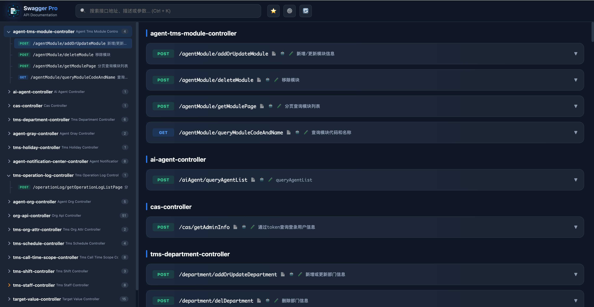
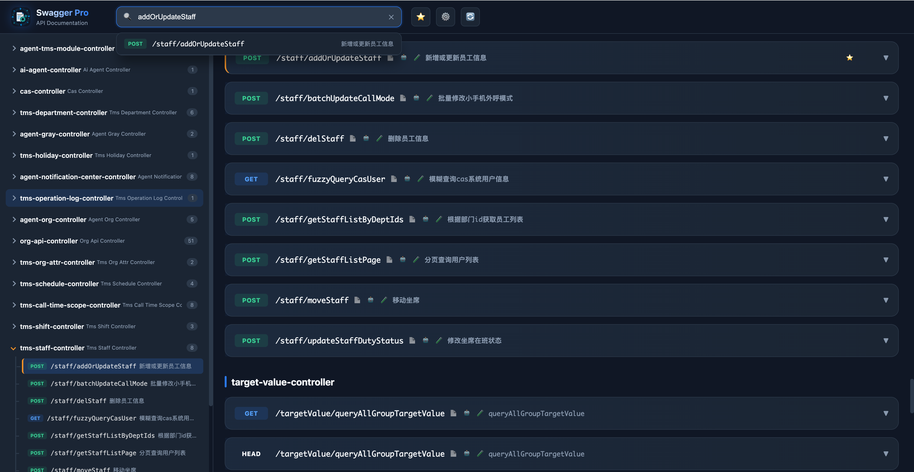
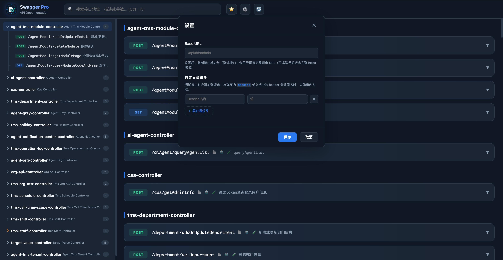
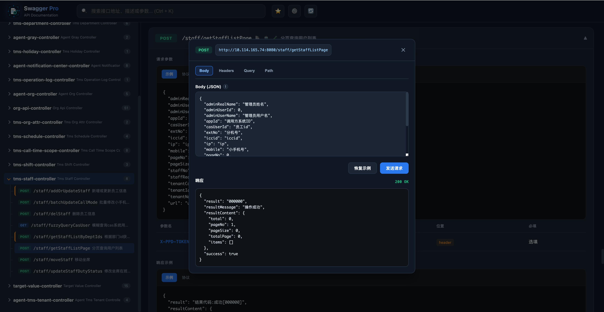
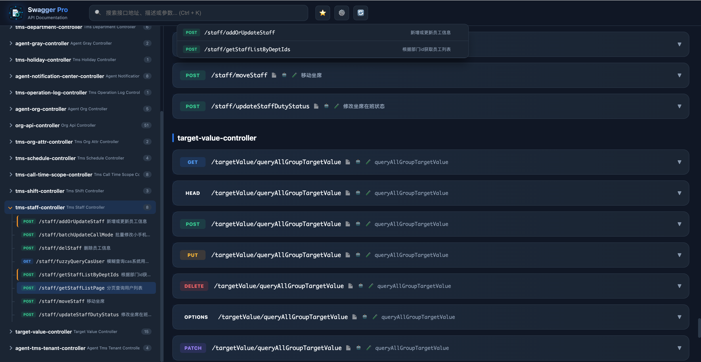
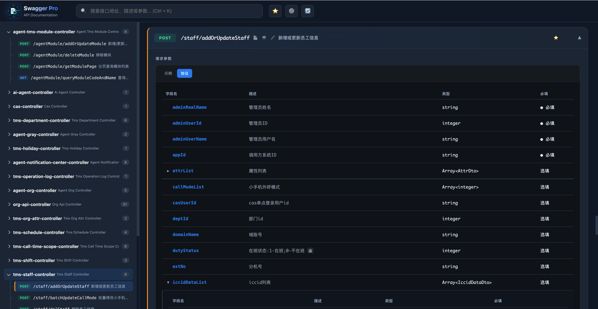

# Swagger Pro

  <a href="https://chromewebstore.google.com/detail/swagger-pro/bmfmbgbbmaebllapghpocfpljablpbap?hl=zh-CN">Chrome 网上应用店</a>
  &nbsp;|&nbsp;
  <a href="https://chromewebstore.google.com/detail/swagger-pro/bmfmbgbbmaebllapghpocfpljablpbap?hl=zh-CN">Chrome Web Store</a>

---

## 中文

### 简介

**Swagger Pro** 是一款增强 Swagger / OpenAPI 文档阅读体验的 Chrome 扩展。在常见的 Swagger UI 页面上，将接口列表以更易用的方式呈现：全局搜索、快速复制、收藏、分享链接，以及**接口测试**与**自定义请求头**等能力，提升日常联调与文档查阅效率。

### 功能特性

| 能力 | 说明 |
|------|------|
| 全局搜索 | 支持按路径、描述、方法等快速检索接口（含快捷键） |
| 侧栏导航 | 按 Tag 分组，可调整侧栏宽度 |
| 快速复制 | 复制完整接口地址（可配置 Base URL） |
| 协议复制 | 一键复制入参/出参协议，便于对接 AI 或文档 |
| 收藏 | 本地收藏常用接口，快速跳转 |
| 分享 | 生成可定位到接口的分享链接并复制 |
| 自定义请求头 | 在设置中配置键值对，**测试接口**时自动附加（弹窗内 Headers 可覆盖同名项） |
| 接口测试 | Postman 风格 Tab：**Body / Headers / Query / Path**，默认填充与文档「示例」一致的参数；请求经后台脚本转发，减轻页面跨域限制 |
| 深色主题 | 与常见开发工具风格一致的界面 |

### 界面预览

以下为部分使用场景截图。

| 主界面 | 全局搜索 |
|:---:|:---:|
|  |  |

| 设置（Base URL / 自定义请求头） | 接口测试弹窗 |
|:---:|:---:|
|  |  |

| 收藏 | 接口详情与协议 |
|:---:|:---:|
|  |  |

### 从 Chrome 应用商店安装（推荐）

1. 打开 [Swagger Pro - Chrome 应用商店](https://chromewebstore.google.com/detail/swagger-pro/bmfmbgbbmaebllapghpocfpljablpbap?hl=zh-CN&utm_source=ext_sidebar)
2. 点击 **添加至 Chrome** 并完成安装
3. 在浏览器中打开你的 **Swagger UI** 文档页面
4. 点击浏览器工具栏上的 **Swagger Pro** 扩展图标，页面将切换为增强后的 UI

### 使用说明

1. **Base URL**（可选）  
   打开顶部 **设置**，填写 Base URL。复制接口地址时会自动拼接；**测试接口**时也会用于拼出完整请求 URL。

2. **自定义请求头**（可选）  
   在同一设置面板中添加多组 Header。测试请求时会带上这些头；若与接口文档中的 Header 或弹窗里填写的同名，**以弹窗内为准**。

3. **测试接口**  
   在接口卡片上点击 **测试**（🧪），在弹窗中切换 Tab 编辑参数后点击 **发送请求**。响应体会显示在下方。  
   - GET/HEAD 等方法下 Body 区域会禁用并提示说明。  
   - 若路径中仍有 `{param}` 未替换，请先切换到 **Path** Tab 补全。

4. **隐私与数据**  
   收藏、Base URL、自定义请求头等保存在浏览器 **本地（localStorage）**，不上传服务器。扩展为完成文档拉取与接口测试，需要较宽的站点访问权限；具体以 Chrome 商店公示为准。

### 兼容性说明

- 适用于在浏览器中打开的 **Swagger UI** 页面，且扩展能按页面同源路径拉取到 OpenAPI 文档（v2 / v3 常见布局）。
- 接口测试依赖扩展上下文中的网络请求；Cookie 等浏览器凭据**不会**像同源页面那样自动附带，必要时请在自定义请求头或 Headers Tab 中手动填写 `Authorization` / `Cookie` 等。

### 参与贡献

欢迎 Issue / Pull Request：功能建议、Bug 修复、文档改进均可。

---

## English

### Overview

**Swagger Pro** is a Chrome extension that improves Swagger / OpenAPI documentation reading on typical **Swagger UI** pages. It presents the API list in a clearer way: global search, quick copy, favorites, shareable links, plus **API testing** and **custom request headers**—to speed up day-to-day integration and doc browsing.

### Features

| Feature | Description |
|---------|-------------|
| Global search | Search by path, summary, method, etc. (with shortcuts) |
| Sidebar | Grouped by tags; resizable sidebar width |
| Quick copy | Copy the full operation URL (optional Base URL) |
| Protocol copy | One-click copy of request/response protocol text for AI or docs |
| Favorites | Locally favorite operations and jump to them quickly |
| Share | Generate a deep link to an operation and copy it |
| Custom headers | Configure key/value pairs in Settings; attached when **testing** (values in the modal **Headers** tab override same-name keys) |
| Test API | Postman-style tabs: **Body / Headers / Query / Path**; defaults match doc **examples**; requests go through the background script to ease cross-origin limits |
| Dark theme | UI aligned with common developer tools |

### Screenshots

Sample screenshots for a few usage scenarios.

| Main view | Global search |
|:---:|:---:|
|  |  |

| Settings (Base URL / custom headers) | Test API modal |
|:---:|:---:|
|  |  |

| Favorites | Operation details & protocol |
|:---:|:---:|
|  |  |

### Install from Chrome Web Store (recommended)

1. Open [Swagger Pro on Chrome Web Store](https://chromewebstore.google.com/detail/swagger-pro/bmfmbgbbmaebllapghpocfpljablpbap?hl=zh-CN&utm_source=ext_sidebar)
2. Click **Add to Chrome** and complete installation
3. Open your **Swagger UI** documentation page in the browser
4. Click the **Swagger Pro** icon in the toolbar to switch to the enhanced UI

### Usage

1. **Base URL** (optional) — Open **Settings** at the top and set Base URL. It is used when copying the operation URL and when building the full URL for **Test API**.

2. **Custom headers** (optional) — In the same settings panel, add header rows. They are sent with test requests; if a name conflicts with a header from the doc or from the modal, **the modal wins**.

3. **Test API** — On a card, click **Test** (🧪), edit tabs in the dialog, then **Send**. The response body appears below.  
   - For GET/HEAD and similar methods, the Body area is disabled with a short note.  
   - If the path still contains `{param}` placeholders, switch to the **Path** tab and fill them in first.

4. **Privacy & data** — Favorites, Base URL, and custom headers are stored **locally** in the browser (**localStorage**) and are not uploaded to any server. The extension needs broad site access to fetch the spec and to run tests; see the Chrome Web Store listing for the official statement.

### Compatibility

- Works on **Swagger UI** pages opened in the browser, where the extension can fetch the OpenAPI document from paths relative to the page origin (common v2 / v3 layouts).
- Test requests run in the extension context; browser credentials such as cookies are **not** automatically attached like a same-origin page request. Add `Authorization` / `Cookie` etc. in custom headers or the **Headers** tab when needed.

### Contributing

Issues and Pull Requests are welcome—for feature ideas, bug fixes, and documentation improvements.

---

## Links

- **Chrome Web Store**: [Swagger Pro](https://chromewebstore.google.com/detail/swagger-pro/bmfmbgbbmaebllapghpocfpljablpbap?hl=zh-CN&utm_source=ext_sidebar)
